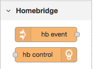
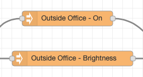

# Homebride and HAP-NodeRed

<p align="center">
    
</p>


# Table of Contents
<!--ts-->
   * [Homebride and HAP-NodeRed](#homebride-and-hap-nodered)
   * [Table of Contents](#table-of-contents)
   * [Introduction](#introduction)
   * [Installation](#installation)
      * [1 - Install Node-RED ( I won't cover that here.)](#1---install-node-red--i-wont-cover-that-here)
      * [2 - Setup your homebridge instances into "INSECURE MODE".  This is same as my <a href="https://github.com/NorthernMan54/homebridge-alexa">Homebridge Alexa</a> plugin, and you just need to follow the <a href="https://github.com/NorthernMan54/homebridge-alexa#prepare-homebridge-for-plugin-installation">Prepare homebridge for plugin</a>](#2---setup-your-homebridge-instances-into-insecure-mode--this-is-same-as-my-homebridge-alexa-plugin-and-you-just-need-to-follow-the-prepare-homebridge-for-plugin)
      * [3 - Install HAP-NodeRed into Node-Red](#3---install-hap-nodered-into-node-red)
      * [4 - Start Node-Red](#4---start-node-red)
      * [5 - Initial setup and configuration inside Node-Red](#5---initial-setup-and-configuration-inside-node-red)
         * [5.1 Select 'hap event' node and place onto flow.](#51-select-hap-event-node-and-place-onto-flow)
         * [5.2 Double click on hap event node ( now called 'Choose accessory/event')](#52-double-click-on-hap-event-node--now-called-choose-accessoryevent)
         * [5.3 Please select the pencil to the right of the PIN Field.](#53-please-select-the-pencil-to-the-right-of-the-pin-field)
         * [5.4 Please enter your PIN, and select add](#54-please-enter-your-pin-and-select-add)
         * [5.5 Now select done.](#55-now-select-done)
         * [5.6 Now select deploy](#56-now-select-deploy)
         * [5.7 Please wait about 30 seconds.  ( Node-RED is busy discovering all your accessories.)](#57-please-wait-about-30-seconds---node-red-is-busy-discovering-all-your-accessories)
         * [5.8 Initial setup and config is complete.](#58-initial-setup-and-config-is-complete)
      * [6 - Configure 'hap event' to receive updates from your Accessories](#6---configure-hap-event-to-receive-updates-from-your-accessories)
         * [6.1 Double click on hap event node ( now called 'Choose accessory/event')](#61-double-click-on-hap-event-node--now-called-choose-accessoryevent)
         * [6.2 The device drop down should now be populated with all your Homebridge accessories.](#62-the-device-drop-down-should-now-be-populated-with-all-your-homebridge-accessories)
   * [Troubleshooting / DEBUG MODE](#troubleshooting--debug-mode)
      * [To start Node-RED in DEBUG mode, and output HAP-NodeRed debug logs start Node-RED like this.](#to-start-node-red-in-debug-mode-and-output-hap-nodered-debug-logs-start-node-red-like-this)

<!-- Added by: sgracey, at:  -->

<!--te-->

# Introduction

This is an Alpha release of the ability to integrate Homebridge Accessories into [Node-RED](https://nodered.org) so that you can start flows from Homebridge accessory events and control your existing homebridge accessories.  ( To create accessories in HomeKit, please use node-red-contrib-homekit-bridged. )



This create's two separate node's in Node-Red, the first node "hap event" listens for changes to an accessory (ie on/off) and sends a message into Node-Red containing the updated accessory status.  The second node "hap control" allows you to control a homebridge accessory.  Each node is tied to an individual characteristic of an accessory (ie on/off or brightness).  Using a dimmable light bulb as an example, you would configure two nodes for it.  The first for On/Off and the second for brightness.  

# Installation

## 1 - Install Node-RED ( I won't cover that here.)

## 2 - Setup your homebridge instances into "INSECURE MODE".  This is same as my [Homebridge Alexa](https://github.com/NorthernMan54/homebridge-alexa) plugin, and you just need to follow the [Prepare homebridge for plugin](https://github.com/NorthernMan54/homebridge-alexa#prepare-homebridge-for-plugin-installation)

## 3 - Install HAP-NodeRed into Node-Red

```
cd ~/.node-red
npm install -g https://github.com/NorthernMan54/HAP-NodeRed
```

## 4 - Start Node-Red

## 5 - Initial setup and configuration inside Node-Red

### 5.1 Select 'hap event' node and place onto flow.
### 5.2 Double click on hap event node ( now called 'Choose accessory/event')
### 5.3 Please select the pencil to the right of the PIN Field.
### 5.4 Please enter your PIN, and select add
### 5.5 Now select done.
### 5.6 Now select deploy
### 5.7 Please wait about 30 seconds.  ( Node-RED is busy discovering all your accessories.)
### 5.8 Initial setup and config is complete.

## 6 - Configure 'hap event' to receive updates from your Accessories
### 6.1 Double click on hap event node ( now called 'Choose accessory/event')
### 6.2 The device drop down should now be populated with all your Homebridge accessories.

The accessory naming convention is

Homebridge Instance Name ( From your config.json ), Accessory Name, Accessory Type, and Accessory characteristic

# Troubleshooting / DEBUG MODE

## To start Node-RED in DEBUG mode, and output HAP-NodeRed debug logs start Node-RED like this.

```
DEBUG=*,-express* node-red
```
