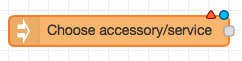
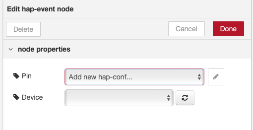

# Homebridge Automation powered by Node-RED

<p align="center">
    
</p>

The above Node-RED Flow, turns on my 'Outside Office' light when the powder room is turned on, and turns them both off after 10 seconds. Not practical but a good sample of the power behind Node-RED. [Link](docs/sample.json) to exported flow for above.

# Table of Contents

<!--ts-->
* [Homebridge Automation powered by Node-RED](#homebridge-automation-powered-by-node-red)
* [Table of Contents](#table-of-contents)
* [Introduction](#introduction)
   * [Caveats](#caveats)
   * [Changes](#changes)
      * [Mar 18, 2019 - Version 0.0.39](#mar-18-2019---version-0039)
      * [Mar 19, 2019 - Version 0.0.42](#mar-19-2019---version-0042)
      * [Mar 31, 2019 - Version 0.0.](#mar-31-2019---version-00)
      * [May 9, 2019 - Version 0.0.43](#may-9-2019---version-0043)
      * [May 15, 2019 - Version 0.0.44](#may-15-2019---version-0044)
      * [May 29, 2019 - Version 0.0.45](#may-29-2019---version-0045)
      * [July 27, 2019 - Version 0.0.50](#july-27-2019---version-0050)
      * [Feb 24, 2020 - Version 0.0.56](#feb-24-2020---version-0056)
      * [Mar 18, 2020 - Version 0.0.59](#mar-18-2020---version-0059)
      * [Oct 13, 2020 - Version 0.0.71](#oct-13-2020---version-0071)
      * [Oct 24, 2020 - Version 0.0.71](#oct-24-2020---version-0071)
      * [Nov 1, 2020 - Version 0.0.73](#nov-1-2020---version-0073)
      * [Nov 13, 2020 - Version 0.0.76](#nov-13-2020---version-0076)
      * [Feb 2, 2021 - Version 0.0.78](#feb-2-2021---version-0078)
      * [Mar 9, 2021 - Version 0.0.80](#mar-9-2021---version-0080)
      * [April 23, 2021 - Version 0.0.82](#april-23-2021---version-0082)
      * [Dec 31, 2022 - Version 0.1.3](#dec-31-2022---version-013)
      * [Jan 6, 2023 - Version 0.1.5](#jan-6-2023---version-015)
      * [Jan 11, 2023 - Version 0.1.7](#jan-11-2023---version-017)
      * [Jan 15, 2023 - Version 0.1.8](#jan-15-2023---version-018)
* [Backlog / Roadmap](#backlog--roadmap)
   * [Dropped items](#dropped-items)
* [Installation Steps](#installation-steps)
   * [1 - Install Node-RED and Homebridge](#1---install-node-red-and-homebridge)
   * [2 - Prepare Homebridge for integration with Homebridge-Automation](#2---prepare-homebridge-for-integration-with-homebridge-automation)
   * [3 - Install Homebridge-Automation into Node-Red](#3---install-homebridge-automation-into-node-red)
   * [4 - Start Node-Red](#4---start-node-red)
   * [5 - Initial setup and configuration inside Node-Red](#5---initial-setup-and-configuration-inside-node-red)
   * [6 - Configure 'hb event' to receive updates from your Accessories](#6---configure-hb-event-to-receive-updates-from-your-accessories)
* [Node-RED Homebridge-Automation Message Structure](#node-red-homebridge-automation-message-structure)
   * [hb event](#hb-event)
      * [Output](#output)
   * [hb resume](#hb-resume)
      * [input](#input)
      * [output](#output-1)
   * [hb status](#hb-status)
      * [input](#input-1)
      * [output](#output-2)
   * [hb control](#hb-control)
      * [Input](#input-2)
* [Flows Shared from Community](#flows-shared-from-community)
* [Donations](#donations)
* [Troubleshooting / DEBUG MODE](#troubleshooting--debug-mode)
   * [To start Node-RED in DEBUG mode, and output Homebridge-Automation debug logs start Node-RED like this.](#to-start-node-red-in-debug-mode-and-output-homebridge-automation-debug-logs-start-node-red-like-this)

<!-- Created by https://github.com/ekalinin/github-markdown-toc -->
<!-- Added by: runner, at: Sat Jul  6 23:23:03 UTC 2024 -->

<!--te-->

# Introduction

This is a release of the ability to integrate Homebridge Accessories into [Node-RED](https://nodered.org) so that you can start flows from Homebridge accessory events and control your existing homebridge accessories.  ( To create accessories in HomeKit, please use node-red-contrib-homekit-bridged. )


Four different node types are available, the first node `hb event` listens for changes to an accessory (ie on/off) and sends a message into Node-Red containing the updated accessory status.  The second node `hb resume` holds the state of an accessory and supports creating a state resume function. The third node `hb status` allows you to poll an accessory for status. The forth node `hb control` allows you to control a homebridge accessory.  Each node is tied to an individual Home App Tile/Service of an accessory (ie on/off and brightness).

Payload from a dimmable lightbulb.

```
{ "On":true, "Brightness":100 }
```


## Caveats

* Please keep in mind that this integration only works with devices supported/exposed with HomeBridge Plugins.  This does not have visibility to Native HomeKit devices.  ( Similar to my homebridge-alexa plugin. )

* For the `hb event` node, the ability of a Accessory to generate events in Real Time is dependent on how the plugin was architected and the actual device.  Some are very good at generating events in real time, and others only generate events when the Home App is opened to the accessory. YMMV.

With a plugin, you can see if it supports Real Time events, by opening the Home App, and looking at an accessory.  Then trigger a local event outside of homebridge/homekit.  If the accessory updates in real time, then it support Real Events.  ( An example of a local event can be turning on a Smart Light Switch, by the local switch.  Another example would be using the vendor app to control an accessory.)

## Changes

### Mar 18, 2019 - Version 0.0.39

- Changed `hb state` to `hb resume` to make the use case for the node more self-explanatory. If you had used the `hb state` node in your existing flow, nodeRed will not start unless you manually change the node type in the flow file.  To fix the issue, manually edit the flow file in your .node-red directory, and change the type reference `hb-state` to `hb resume`
- Changed individual nodes from being characteristic based to device/service based.  When updating from previous versions, you will need to select your devices again.
- With the change in nodes to be device/service based, the payload message structure changed from being individual characteristic based to a JSON object containing all the characteristics you want to update on the device.  ie in the previous version a device control message payload of `true` going to the On characteristic would turn on a light, with this version it would be be represented with a message payload of `{ "On":true, "Brightness":100 }`.  This particular payload would turn on a light and set the brightness to 100.  I made this change to enable easier intergradation with node-red-contrib-homekit-bridged.
- If you send an incorrect message payload to the `hb resume` or `hb control` nodes it would output a debug message containing the valid/supported characteristics for use in the payload object.
- Updated the Homebridge accessory parser, so more diverse devices will now be exposed.

### Mar 19, 2019 - Version 0.0.42

- Fix for events being missed after homebridge restarts

### Mar 31, 2019 - Version 0.0.

- Fix for a crash when events are received by an accessory with multiple services.

### May 9, 2019 - Version 0.0.43

- Added retries for registering of events during startup.  ( 1000 retries, retry delay of 30 seconds )

### May 15, 2019 - Version 0.0.44

- Added reqTimeout and set default timeout on homebridge requests to 14 seconds

### May 29, 2019 - Version 0.0.45

- Name Change to Homebridge-Automation

### July 27, 2019 - Version 0.0.50

- Publish as a NPM package to resolve #17

### Feb 24, 2020 - Version 0.0.56

- Fix for device naming for Nest FAN and ECO Mode

### Mar 18, 2020 - Version 0.0.59

- Support for the new version of HAP-NodeJS

### Oct 13, 2020 - Version 0.0.71

- Realize that I have not updated the change log for a while, so this is a laundry list of changes since 0.0.59
- Additional error logging
- Fix for issue #47 and #48
- Support camera devices - tks dxdc
- Improved timeout support
- Support for the latest version of homebridge

### Oct 24, 2020 - Version 0.0.71

- Added support for plugins that allow device name editing within the Home app.

### Nov 1, 2020 - Version 0.0.73

- Added support for Air Pressure and Power devices
- Fixed issue #69 TV accessory events not firing since update of homebridge-broadlink-rm plugin

### Nov 13, 2020 - Version 0.0.76

- Update HB Control Node to output snapshot images from camera's.  Payload output format is a buffer object containing image.

### Feb 2, 2021 - Version 0.0.78

- Change hb-control to display control message payload rather than 'Ok'
- Tweak device parser to remove these duplicates
    - Camera RTPStream Management
    - Input Source with a name of 'dummy'

### Mar 9, 2021 - Version 0.0.80

- hbEvent: add option to send initial state

### April 23, 2021 - Version 0.0.82

- Support for homebridge instances with different PINS.  Tks @dxdc

### Dec 31, 2022 - Version 0.1.3

- Removal of request dependency from hap-node-client

### Jan 6, 2023 - Version 0.1.5

- Remove support for ipv6

### Jan 11, 2023 - Version 0.1.7

- Fix for #110 and homebridge-alexa #564

### Jan 15, 2023 - Version 0.1.8

- Workaround for #111

# Backlog / Roadmap

* [x] - Update Node Information with Homebridge Accessory Details ( hapEndpoint, deviceType, description )
* [x] - Sort device drop down listing
* [x] - Trim Node name to just accessory Name
* [x] - Documentation - Fix README with latest options
* [x] - Documentation/Naming - Normalize on Accessory, Service, Event and Characteristic
* [x] - Hap-Node-Client is not reentrant, and multiple requests get lost.  Needs queuing at an instance level.
* [x] - Refactor interface with Hap-Node-Client, and split events into a dedicated evented socket connection and use the regular request module for everything else.
* [x] - Create a service/characteristic based node approach mimicking homekit icons
* [x] - Adjust msg.payload to match other homekit / NodeRED integrations
* [ ] - Further stability testing
* [ ] - With hb-event add a delay function of about 30ms to put back together device level events

## Dropped items

* [ ] - Add timestamp to Node msg object
* [ ] - Do I need a node that emits events for all homebridge devices?

# Installation Steps

## 1 - Install Node-RED and Homebridge

This is covered in alot of other places, so I won't cover it here.

## 2 - Prepare Homebridge for integration with Homebridge-Automation

Place your homebridge instances into "INSECURE MODE".  This is same as my [Homebridge Alexa](https://github.com/NorthernMan54/homebridge-alexa) plugin, and you just need to follow the [Prepare homebridge for plugin](https://github.com/NorthernMan54/homebridge-alexa/blob/master/Installation.md#prepare-homebridge-for-plugin-installation) instructions there.

## 3 - Install Homebridge-Automation into Node-Red

    cd ~/.node-red
    npm install node-red-contrib-homebridge-automation

## 4 - Start Node-Red

## 5 - Initial setup and configuration inside Node-Red

* 5.1 Select 'hb event' node and place onto flow.
* 5.2 Double click on hb event node ( now called 'Choose accessory/event')



* 5.3 Please select the **pencil** to the right of the PIN Field.



* 5.4 Please enter your PIN, and select **Add**.


* 5.5 Now select **Done**.


* 5.6 Now select **Deploy**
* 5.7 Please wait about 30 seconds.  ( Node-RED is busy discovering all your accessories.)
* 5.8 Initial setup and config is complete.

## 6 - Configure 'hb event' to receive updates from your Accessories

* 6.1 Double click on hb event node ( now called 'Choose accessory/service')


* 6.2 The device drop down should now be populated with all your Homebridge accessories.


The accessory naming convention is:

Accessory Name and Accessory Service Type

# Node-RED Homebridge-Automation Message Structure

## hb event

This node generates a message every time an Accessory changes status, and generates a message containing the updated status of all the characteristics.

### Output

Message is structured like this

```
msg = {
  name: Accessory Name,
  payload: { "On":true, "Brightness":100 }
  Homebridge: Homebridge instance name,
  Manufacturer: Plugin Manufacturer,
  Type: Homebridge device type,
  _device: Unique device identifier,
  _confId: node.confId,
  _rawEvent: Raw event message
};
```

Message payload will vary depending on characteristics support by the device, this example is from a dimmable light.

Please note that multiple event messages may be received from a single device event, this is due to how homebridge controls devices and emits events.

## hb resume

This node can be used to create a resume previous state flow.  Where you change the state of an accessory, and have it resume the previous state afterwards.  I'm using this, in conjunction with Alexa to give the ability to turn on and off the lights in a room, but not turn any lights that were already on.  I'm also using it with the HomeKit "I'm home" automation, to turn a group of lights for a few minutes then turn off.  But at the same time have any lights you already had on, stay on.

### input

Based on the message input payload and state of the accessory the output changes.

For  `{"On":true}`, the node just passes the message to output.  For the first `{"On":false}`, the output is the state of the accessory from prior to the last turn on.  For the second `{"On":false}`, the out is `{"On":false}`.

```
msg = {
  payload: { "On":true, "Brightness":100 }
};
```

### output

```
msg = {
  payload: { "On":true, "Brightness":100 }
};
```
Message payload will vary depending on characteristics support by the device, this sample is from a dimmable light.

To find supported characteristics for a device, please send an invalid message payload to the node, and it will output the supported characteristics in the debug log.

## hb status

This node allows you to poll a Homebridge accessory and collect the current status of all the characteristics.

### input

Anything

### output

Message is structured like this

```
msg = {
  name: Accessory Name,
  payload: { "On":true, "Brightness":100 }
  Homebridge: Homebridge instance name,
  Manufacturer: Plugin Manufacturer,
  Type: Homebridge device type,
  _device: Unique device identifier,
  _confId: node.confId,
  _rawEvent: Raw event message
};
```
Message payload will vary depending on characteristics support by the device, this sample is from a dimmable light.

## hb control

This node allows you to control all the characteristics of a Homebridge accessory.  The message payload needs to be a JSON object containing the values of all the characteristics you want to change.  If you send the node an invalid payload, it will output all the available characteristics of the accessory in the debug tab.

### Input

The hb control node only looks at msg.payload value, and ignore's all others.

```
msg = {
        payload: { "On":true, "Brightness":100 }
      }
```
Message payload will vary depending on characteristics support by the device, this sample is from a dimmable light.

To find supported characteristics for a device, please send an invalid message payload to the node, and it will output the supported characteristics in the debug log.

# Flows Shared from Community

I have started collecting flows for useful functions on the wiki.

https://github.com/NorthernMan54/node-red-contrib-homebridge-automation/wiki

# Donations

[](https://www.paypal.com/cgi-bin/webscr?cmd=_s-xclick&hosted_button_id=6V3MNYYR446EG)

# Troubleshooting / DEBUG MODE

## To start Node-RED in DEBUG mode, and output Homebridge-Automation debug logs start Node-RED like this.

```
DEBUG=-express*,-send*,-body-parser*,* node-red
```
